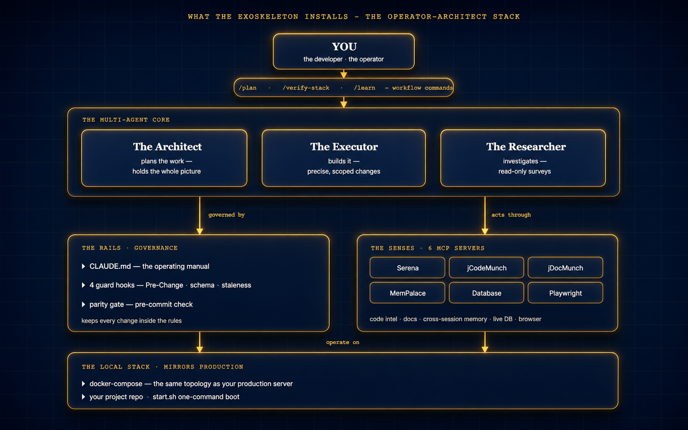
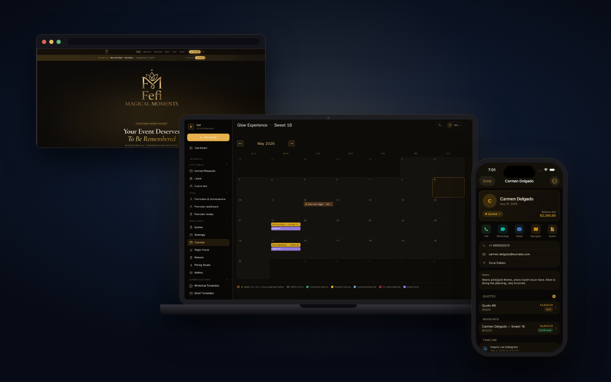

# exoskeleton

A bundle of six Claude Code skills that bootstrap the **Operator-Architect multi-agent stack** from the [*Two Suits* builder's guide](https://christianmerkel.com/two-suits/builders-guide) into any project, local-first, in about ten minutes.

The article *Two Suits* tells the story. **The exoskeleton is what does the work.** This is the exoskeleton.


## What's in the bundle

Six skills. Each invocable standalone. One orchestrator runs them in sequence.

```
.claude/skills/exoskeleton/
├── README.md                          ← you are here
├── exoskeleton-install/               ← orchestrator (run this first)
├── exoskeleton-bootstrap/             ← Stage 0 — fresh-laptop setup (Docker, gh, MCP servers, GitHub auth)
├── exoskeleton-local/                 ← Docker compose + project-specific MCP wiring
├── exoskeleton-manual/                ← generates CLAUDE.md, agents, slash commands
├── exoskeleton-guards/                ← installs the four non-AI guards + parity gate
└── exoskeleton-deploy/                ← VPS deployment wizard (after local is green)
```

The orchestrator probes the machine first — a **three-state check** on every prerequisite and every MCP server:

- **✓** — present and matches the canonical setup
- **~** — present but *drifted*: an MCP installed with a stale or non-canonical command
- **✗** — missing

The probe state decides the handoff:

- **All ✓** — skip Stage 0, go straight to project setup.
- **Any ✗** — run Stage 0 (`exoskeleton-bootstrap`) to install the missing pieces.
- **Any ~** — run Stage 0 in `--reconcile` mode (Phase 5b) to fix the drift, asking before changing each server and leaving unrelated MCPs untouched.

A name-only probe would miss drift entirely — a stale Serena reads as "installed" and quietly breaks the protocol. The three-state probe catches it.

## What the exoskeleton produces

When the orchestrator finishes, you have:

- A `docker-compose.yml` that mirrors a production topology
- A `start.sh` one-command bootstrap
- A `CLAUDE.md` operating manual filled in with your project's specifics
- A `.claude/settings.json` wired to four hooks and the right permissions
- Four guard scripts (`.claude/hooks/` + `.githooks/`)
- Three agent definitions (`.claude/agents/`)
- Three slash commands (`.claude/commands/`)
- A `parity-check.sh.template` you customize for your layers
- A `/verify-stack` slash command that confirms it all works
- (optional) a VPS deployment topology in `bin/vps/` if you ran `/exoskeleton-deploy`



## Built with the exoskeleton

The bundle is the generalized form of a stack that already runs a real business — **Fefi Magical Moments**: a public booking site, a PHP/MariaDB admin backend, and a native iOS app, all built and operated with the operator-architect stack the exoskeleton scaffolds.



Not a demo — it takes real bookings, signs real waivers, processes real payments. The exoskeleton packages that same stack so you can put it on your own project.

## How to install the exoskeleton into your project

### Claude Code

```bash
# From your project's root directory, clone the bundle into the skills folder:
git clone https://github.com/c-merkel/exoskeleton.git .claude/skills/exoskeleton

# Open the project in Claude Code:
claude

# Invoke the orchestrator — it walks the whole install for you, station by station:
> /exoskeleton-install
```

### Codex CLI (OpenAI)

The Agent Skills format became an open standard in late 2025 — Codex CLI loads skills from the same `SKILL.md` files. Install path:

```bash
# From your project's root directory, clone the bundle into the skills folder:
git clone https://github.com/c-merkel/exoskeleton.git .codex/skills/exoskeleton

# Open the project in Codex CLI:
codex

# Invoke the orchestrator — it walks the whole install for you, station by station:
> /exoskeleton-install
```

If Codex stores skills in a different default path on your machine, check `codex skills path` (or the equivalent for your version) and clone there instead. The skill behavior is identical across both AIs — same prompts, same outputs.

### Either AI

The bundle is dual-target: the `SKILL.md` files contain no Claude-Code-specific syntax. The hooks under `templates/hooks/` are bash + python and OS-portable. The only AI-specific surface is the sub-agent definitions under `templates/agents/`, which assume Claude's `Task` tool naming — Codex users may need to swap `Task → spawn_agent` (or the Codex equivalent) when invoking them.

## The first thing it asks: your pace

Before any probe or command, the orchestrator asks one question — have you set up a development environment before? Your answer sets the pace for the entire run:

- **Concierge Mode** — first-timers. One command at a time, a plain-English preamble before each, every line of terminal output translated, a small celebration at each win. Built for the creative-side-of-the-business user who has never opened a terminal.
- **Express Mode** — experienced users. One message per phase, all commands at once, no preamble. Pace, not silence — you still get a fix recommendation when something fails.

Say "slow down" or "go faster" at any point to switch. The chosen pace carries into every sub-skill the orchestrator dispatches.

## Local-first by design

The orchestrator gets a working local environment running **before** asking about VPS credentials. You can stop after `/exoskeleton-local` and never deploy to a server — the local stack stands on its own. The `/exoskeleton-deploy` skill is opt-in, runs last, and asks for explicit credentials.

## Invoking sub-skills individually

You don't have to run the orchestrator. Each sub-skill is a slash command:

```
/exoskeleton-bootstrap     # Stage 0 — fresh-laptop setup (Docker, gh, MCP, GitHub auth)
/exoskeleton-local         # local Docker + project-specific MCP wiring
/exoskeleton-manual        # generates the operating manual
/exoskeleton-guards        # installs the four guards
/exoskeleton-deploy        # VPS deployment wizard
```

Useful when re-running a single stage after a config change, or when you already have parts of the stack and only need to fill in one piece.

`exoskeleton-bootstrap` also takes two flags for the upgrade path:

- `/exoskeleton-bootstrap --reconcile` — skip straight to MCP reconciliation (Phase 5b). Diffs your installed MCP servers against the canonical set, asks before fixing each drifted one, and preserves servers you use for other projects. This is what the orchestrator's probe invokes when it sees a `~` row.
- `/exoskeleton-bootstrap --clean` — remove the canonical MCP servers and reinstall them from scratch. Destructive; use only when you explicitly want a clean slate.

## Each station offers three modes

The builder's guide is organized into ten stations. At every station, you can:

1. **Run the skill** — invoke `/exoskeleton-<station>` and the bundle does it for you. You read along to learn what happened.
2. **Use a prompt** — copy the prompt block, paste it into your own Claude (or any AI), and let your AI do the work with your adjustments.
3. **Do it manually** — type every command and write every file yourself.

All three end at the same place. The skill mode is the fastest; the manual mode is the most instructive. Pick the one that fits your moment.

## Prerequisites

- Claude Code installed (`claude.com/claude-code`)
- Docker Desktop (or compatible) for the local stack
- `git` configured with the project repo
- About 10 minutes for the local install, another 15–20 for VPS

## Platform support

The four guards and the git hooks are written in `bash` + `python3`. Specifically:

- **macOS** — fully supported. This is the platform the bundle was built and tested on.
- **Linux** — fully supported. Templates use the GNU-flavored utilities (`sed -i 's/.../.../'`, `grep -P`, etc.) that ship with every mainstream distro.
- **Windows (native PowerShell/cmd)** — not supported. The hooks are bash scripts, and git hooks invoked via `core.hooksPath` don't translate cleanly to native Windows shells.
- **Windows via WSL2** — fully supported. Claude Code on Windows is documented to run inside WSL2 anyway; inside that environment the bundle behaves exactly like Linux. Docker Desktop bridges to the WSL2 backend transparently.

If you're on Windows and not already using WSL2, install it first (`wsl --install`) and run Claude Code from the WSL2 shell. The exoskeleton bundle has no native-Windows codepath and there is no plan to add one — WSL2 is the supported answer.

## Companion reading

The full Two Suits universe lives at [**christianmerkel.com/two-suits**](https://christianmerkel.com/two-suits) — the **Information Hub** that links to every piece below in one place.

- **Two Suits — Information Hub:** [christianmerkel.com/two-suits](https://christianmerkel.com/two-suits) — the landing page; pick your door from there.
- **Start Here:** [the friendly walkthrough](https://christianmerkel.com/two-suits/start-here) — fit your own exoskeleton in 11 stages, about 30 minutes, no jargon.
- **The Showcase:** [see what it built](https://christianmerkel.com/two-suits/showcase) — a real production business in 16 screenshots: public site, web admin, native iOS.
- **The Story:** [*Two Suits*](https://christianmerkel.com/two-suits/story) — first-person narrative of the build.
- **The Builder's Guide:** [*Two Suits — Builder's Guide*](https://christianmerkel.com/two-suits/builders-guide) — the architecture as a map; 11 stations, 3 modes each.
- **The Graphic Novel:** [*Two Suits — The Graphic Novel*](https://christianmerkel.com/two-suits/comic) — the painterly cinematic companion.

---

Stack-agnostic. The bundle works for any language, any framework, any database — you provide the stack-specific bits in the prompts. The patterns ship in the templates; the implementation is yours.
